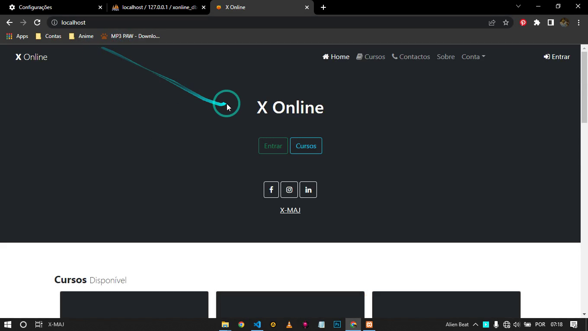

# Projeto X Online (PHP)

## Visão Geral
Projeto X Online é um inovador sistema em constante desenvolvimento, projetado para democratizar o acesso a uma ampla variedade de cursos em diversas áreas. Atualmente em fase de protótipo, o projeto tem como objetivo oferecer uma plataforma intuitiva onde qualquer pessoa pode descobrir, solicitar e cursar cursos de sua escolha.

## Instruções de Uso
**Nota Importante:** O sistema utiliza o Composer para gerenciar suas dependências. Antes de executar o projeto, é crucial extrair a pasta `vendor` a partir do arquivo `vendor.zip` que você encontrará no repositório. Sem esta pasta, o sistema não funcionará corretamente.

### Passos para Extrair a Pasta `vendor`:
1. **Baixe o Projeto:**
   - Faça o clone do repositório ou baixe o projeto como um arquivo ZIP.

2. **Extraia a Pasta `vendor`:**
   - Encontre o arquivo `vendor.zip` no projeto e extraia seu conteúdo. Certifique-se de que a pasta resultante seja nomeada como `vendor`.

3. **Configuração Adicional (Se Necessário):**
   - Dependendo do ambiente de execução, você pode precisar configurar seu servidor web ou ambiente PHP.

4. **Execute o Projeto:**
   - Com a pasta `vendor` extraída e qualquer configuração adicional concluída, você estará pronto para executar o projeto.

## Recursos Atuais

- **Cadastro de Cursos:** Os administradores podem cadastrar cursos, especificando detalhes como nome, área de estudo e valores.
  
- **Cadastro de Alunos:** Potenciais estudantes podem se cadastrar na plataforma, explorar cursos disponíveis e solicitar sua participação.

- **Pesquisa de Cursos:** Os usuários têm a capacidade de pesquisar cursos com base em áreas específicas de interesse.

- **Informações Básicas:** O sistema fornece informações básicas sobre cada curso, incluindo quem está atualmente cursando, o número total de alunos matriculados e detalhes essenciais.

## Recursos Futuros Planejados
- **Geração de Certificados:** O sistema irá incorporar a capacidade de gerar certificados de conclusão para os alunos que finalizarem um curso com sucesso.

- **Cartão de Estudante/Aluno:** Está nos planos a implementação de um recurso que permitirá a criação de cartões de estudante/aluno virtuais.

- **Detalhes Avançados dos Cursos:** Adição de informações mais detalhadas, como horários de aula e outras características específicas de cada curso.

## Desenvolvimento Contínuo
O projeto é público, permitindo que qualquer pessoa acompanhe seu desenvolvimento, faça download e forneça feedback valioso. A transparência é essencial, e os usuários são encorajados a participar da jornada de construção deste sistema PHP.

## Nota Importante
Este projeto está em constante evolução e ainda não atingiu sua forma final. É um esforço colaborativo em que todos estão convidados a baixar, explorar e acompanhar o progresso deste projeto promissor.
